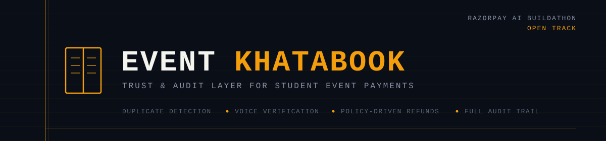
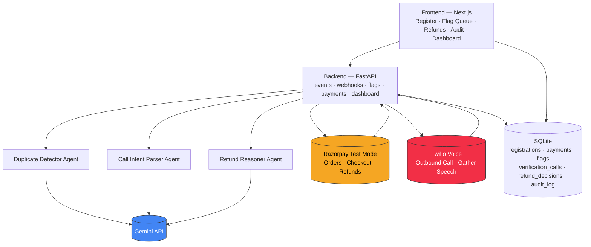
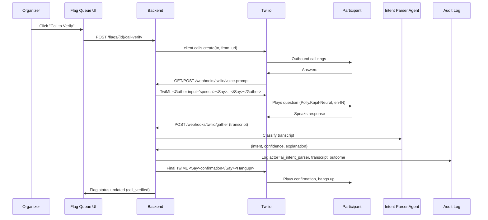

# Event KhataBook

**An AI-powered trust and audit layer for student event payments.**




---

## The Problem

Student technical societies run paid events constantly like workshops, fests, competitions and collecting payments through Razorpay checkout links or forms. In practice, this creates three recurring failures that anyone who has actually run event payments for a college society has lived through:

- **Duplicate registrations and duplicate payments.** A participant pays twice after a slow UPI confirmation, or registers twice with slightly different name/email/phone combinations — inflating headcount and creating refund ambiguity.
- **Ad-hoc refund decisions.** Cancellations and postponements get resolved manually, with no consistent policy and no record of *why* a refund was approved or denied.
- **Zero real-time financial visibility.** The faculty member or treasurer who has to sign off on an event's finances gets a spreadsheet stitched together after the fact, with no live view and no audit trail.

This isn't a hypothetical problem. It's the operational reality of running payment collection for a student body.

---

## What It Does

- **Detects likely duplicate registrations and payments** using fuzzy matching (name, email, phone, roll number) plus an AI agent that explains *why* something was flagged, with a confidence score, not just an exact-match `WHERE email =`.
- **Places a real outbound voice call** (via Twilio) to the participant to verify a flagged case in their own words, instead of waiting on a human to click through a queue.
- **Parses the spoken response with an AI agent** that classifies intent (confirms / denies / unclear) and auto-resolves the flag or escalates it to a human.
- **Reasons about refunds against a fixed, non-negotiable policy** : the AI classifies which policy clause applies and explains its reasoning; it does not invent refund amounts.
- **Executes real refunds through Razorpay's test-mode Refunds API** and persists the actual refund ID — never a fabricated one.
- **Logs every AI recommendation, call outcome, and human decision** to an immutable, actor-attributed audit trail.
- **Shows a live reconciliation dashboard** like collected, refunded, open flags, and call outcomes; in a dense, ledger-style UI built to look like a financial audit tool, not a generic SaaS dashboard.

---

## Why This Isn't Just an LLM Wrapper

Three things enforce that the AI is doing real, bounded, verifiable work rather than freelancing:

1. **Structured, schema-validated JSON only.** All three agents (Duplicate Detector, Call Intent Parser, Refund Reasoner) return typed JSON, never free text — because their output drives real actions (flags, calls, refunds).
2. **A hardcoded refund policy the AI classifies against, not invents.** The four refund clauses (full refund >72h out, 50% refund <72h out, no refund on no-show, refund-the-extra on duplicate payment) are fixed in code. The AI's job is to classify a request against them and explain the reasoning — never to decide an amount itself.
3. **An actor-attributed audit log that proves which path ran.** Every audit entry records whether real AI reasoning executed (`ai_duplicate_detector`, `ai_intent_parser`, `ai_refund_reasoner`, `twilio_voice`) or a rule-based fallback did (`fallback_rule_engine`, `simulated_call`) — so the system's own audit trail is evidence for what actually happened, not a claim you have to take on faith.

---

## Architecture



### The verification call flow, in sequence



---

## Tech Stack

| Layer | Technology |
|---|---|
| Frontend | Next.js 16, TypeScript, Tailwind CSS |
| Backend | FastAPI (Python), Pydantic schemas |
| Database | SQLite + SQLAlchemy |
| AI reasoning | Gemini API, structured JSON output, with explicit rule-based fallback |
| Payments | Razorpay Test Mode — Orders API, Checkout.js, Webhooks, Refunds API |
| Voice | Twilio Voice API, `<Gather input="speech">`, Amazon Polly neural voice (`Polly.Kajal-Neural`, en-IN) |
| Design system | IBM Plex Mono / Space Grotesk, dense ledger-style UI, single amber accent, no gradients |

---

## Verified Results

Automated ground-truth test (`backend/tests/test_demo_metric.py`), run against a seeded dataset of 50 registrations with planted duplicates and refund scenarios:

| Metric | Result |
|---|---|
| Planted duplicates caught | 8 / 8 |
| False positives | 0 |
| Duplicate detection precision / recall | 100% / 100% |
| Refund decisions with full audit trail | 100% |

> Re-run `pytest tests/test_demo_metric.py -v` before your final submission to confirm these numbers still hold — they were last verified prior to wiring up the real Razorpay Checkout and refund flow, and should be re-checked against the current codebase.

Every action in the system has AI recommendation, call outcome, human decision and is written to an audit log with an explicit actor field, so it's possible to verify from the log itself whether real AI reasoning ran or a fallback did, and whether a Razorpay refund was actually executed or blocked for a stated reason.

---

## How to Run Locally

```bash
# 1. Backend
cd backend
pip install -r requirements.txt
python seed.py                            # seeds 50 registrations + 8 planted duplicates
python -m uvicorn app.main:app --reload   # http://localhost:8000

# 2. Frontend
cd frontend
npm install
npm run dev                                # http://localhost:3000

# 3. Tests
cd backend
python -m pytest tests/test_demo_metric.py -v
```

### Environment Variables (`backend/.env`)

| Variable | Required | Purpose |
|---|---|---|
| `GEMINI_API_KEY` | Recommended | Enables real AI reasoning across all three agents (falls back to rule-based heuristics if absent) |
| `RAZORPAY_KEY_ID` | Recommended | Enables real Razorpay test-mode orders, checkout, and refunds |
| `RAZORPAY_KEY_SECRET` | Recommended | " |
| `TWILIO_ACCOUNT_SID` | Recommended | Enables real outbound verification calls (falls back to in-browser simulator if absent) |
| `TWILIO_AUTH_TOKEN` | Recommended | " |
| `TWILIO_PHONE_NUMBER` | Recommended | " |
| `BASE_URL` | Required for real Twilio calls | Public URL (e.g. an ngrok tunnel) Twilio can reach for webhook callbacks :  `localhost` will not work |

For a live demo without any external credentials configured, the in-browser call simulator on the Flag Queue page exercises the same Intent Parser and audit logic without needing a real Twilio call.

---

## What's Next / Known Limitations

- **Single-turn voice verification only.** The Twilio flow uses one `<Gather>` question and one spoken answer, not a full conversational, multi-turn voice agent (Twilio Media Streams). This was a deliberate scope decision for reliability within a hackathon build window.
- **Single-event scope.** The current build handles one event at a time; multi-event/multi-organization support is a natural next step.
- **Trial-tier Twilio restrictions.** Outbound calls currently require verifying each destination number under Twilio's trial Verified Caller IDs; a paid Twilio account removes this restriction.
- **Fuzzy matching, not identity verification.** Duplicate detection is deliberately lightweight (name/email/phone/roll-number similarity); it is not a KYC-grade identity check, by design.
- **Reconciliation match-rate metric is planned but not yet surfaced in the UI** : it's computable from existing data but not currently rendered on the dashboard.

---

## Demo Script

1. Register live with a real Razorpay test card, showing a genuine Order ID.
2. Register a near-duplicate (same phone, slightly different name/email) then watch it get flagged with an AI explanation and matched fields.
3. Trigger "Call to Verify" : a real phone rings, asks the question, captures the spoken answer.
4. Show the flag auto-resolve and the refund fire through Razorpay's real Refunds API.
5. Open the Audit Log and point at the actor field on each entry : proof of what actually ran.
6. Pull up Razorpay's own test-mode dashboard side by side to confirm the refund is real, not just an internal status flip.
